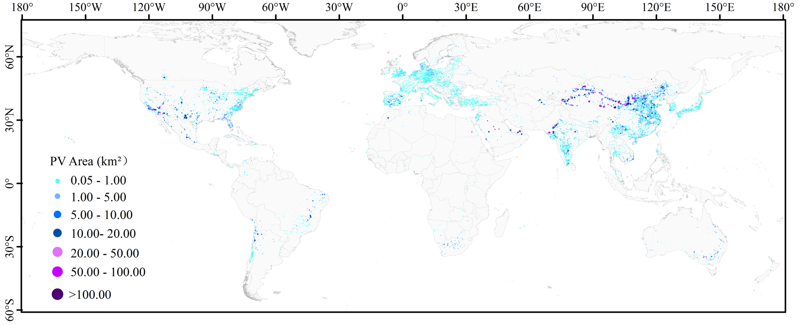

# Fusion PV Mapping
📢 <font size=3>**Our code and product will be made publicly available once the paper is accepted**</font>  
The official code of paper: Mapping global photovoltaic power plants via adaptive
normalized difference photovoltaic index-based multi-source data fusion method  
✨**Abstract:** This paper develop an efficient framework for global PV mapping that integrates the proposed adaptive normalized difference photovoltaic index
(ANDPI) with a multi-source data fusion algorithm to extract accurate contours of PV power plants from Sentinel-2 imagery. We generate the global mapping product of PV power plants at 10 m resolution from 2019 to 2025Q2.

## 🏆Mapping Product
Our mapping product will be publicly available on [Zenodo]()

## 🛠️Requirement
* python >= 3.12.7
* numpy >= 1.26.4
* scipy >= 1.7.1
* scikit-image >= 0.24.0
* opencv-python >= 4.11.0.86
* pillow >= 10.4.0
* matplotlib >= 3.9.2

## 🔍Raw Dataset
1. TZ-SAM: https://www.transitionzero.org/products/solar-asset-mapper/download
2. ChinaPV: https://doi.org/10.6084/m9.figshare.25347880.v1
3. GlobalPV:https://cxh1216.users.earthengine.app/view/solarpv-bnu
## 💡Global PV Mapping Result


## 📜Citation
If you use our product or this study is helpful for you, please cite this project.
```bibtex
@inproceedings{,
  title={},
  author={},
  booktitle={},
  year={2025}
}
```
## ❤️Acknowledgements
Thanks to [geemap](https://geemap.org/) and the [Google Earth Engine (GEE) platform](https://earthengine.google.com/). 
GEE provides open access to global remote sensing data. Geemap offers convenient data download APIs, enabling us to download data from the GEE platform.

## 📬Contact
If you have any questions regarding the repo, please contact Xiaopeng Zeng (xpzeng666@gmail.com) or create an issue.

